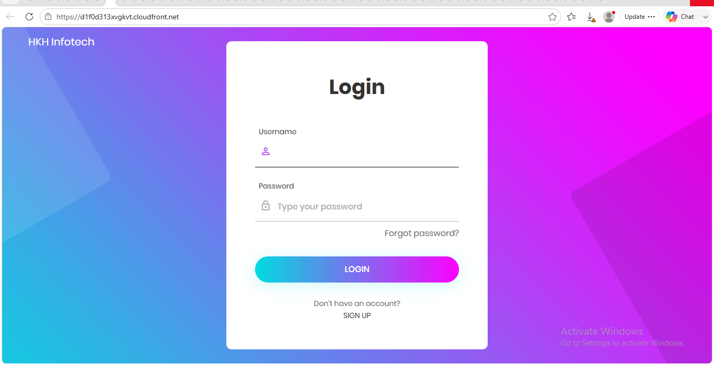
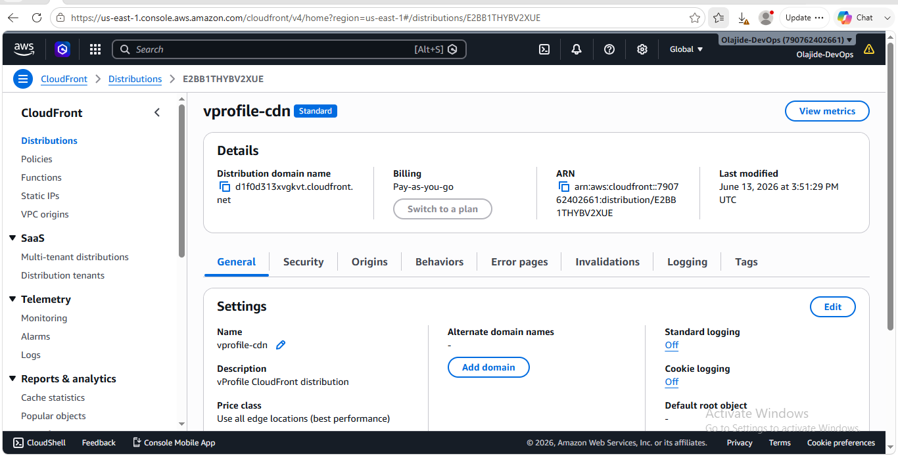
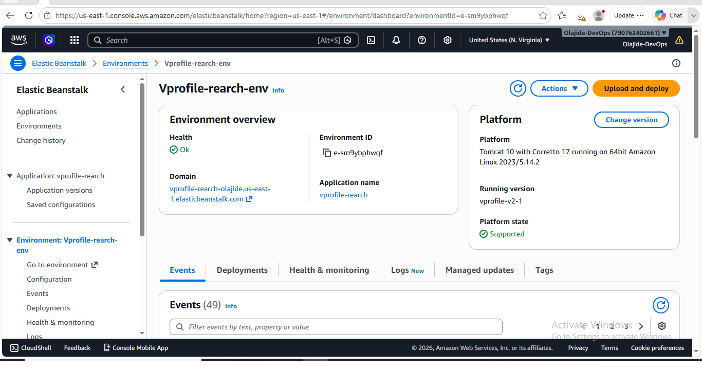
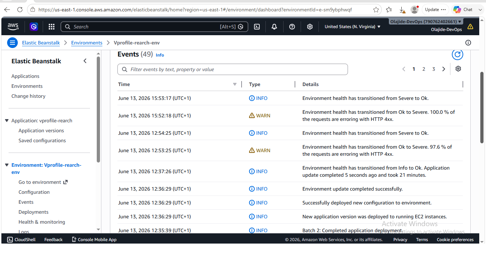
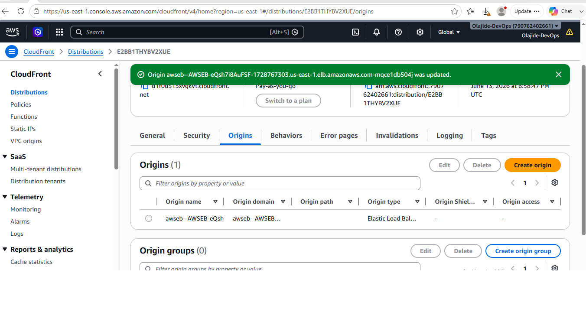
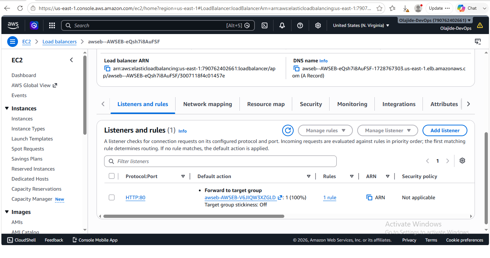
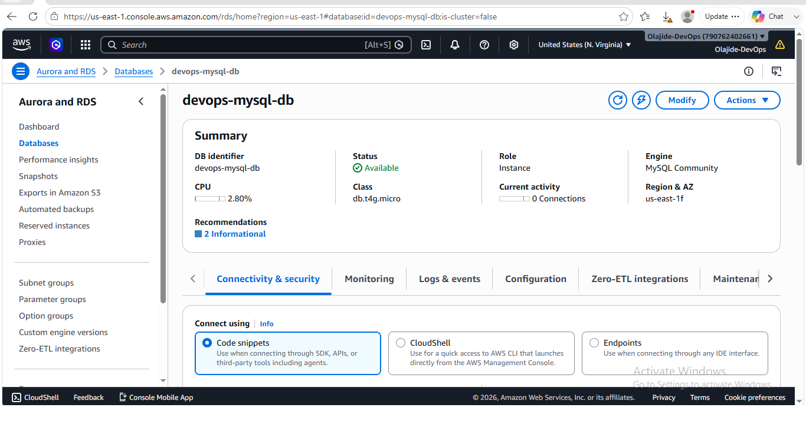

# AWS Re-Architecting Project (vProfile Application)

End-to-End Cloud Migration and Re-Architecture using AWS Managed Services, Load Balancing, and Global Content Delivery Network (CloudFront)

## 📌 Project Overview

This project demonstrates the re-architecture of the vProfile application from a traditional infrastructure deployment model to a modern AWS-managed architecture.

The goal was to improve scalability, availability, performance, and operational efficiency by leveraging AWS managed services instead of relying solely on self-managed infrastructure.

The application was deployed using AWS Elastic Beanstalk and integrated with supporting services including Amazon RDS, Amazon ElastiCache (Memcached), Amazon MQ (RabbitMQ), Application Load Balancer (ALB), Auto Scaling, and Amazon CloudFront.

As part of the project, I also performed troubleshooting and root cause analysis to resolve a CloudFront 504 Gateway Timeout error caused by a protocol mismatch between CloudFront and the application origin.

This project provided hands-on experience with cloud architecture design, deployment automation, traffic management, caching, application delivery, and production-style troubleshooting on AWS.

## 🎯 Business Problem

Traditional application deployments often rely on self-managed infrastructure that requires significant operational effort to maintain, scale, secure, and monitor.

As application traffic grows, challenges such as performance bottlenecks, limited scalability, infrastructure management overhead, and global content delivery become increasingly difficult to address.

The objective of this project was to re-architect the vProfile application using AWS managed services to improve operational efficiency, scalability, reliability, and user experience while reducing the burden of infrastructure management.

---
## 🚀 Project Objectives

The key objectives of this project were:

- Deploy the vProfile Java application using AWS Elastic Beanstalk.
- Implement a scalable application architecture using Auto Scaling and Application Load Balancer.
- Migrate supporting services to AWS-managed solutions.
- Integrate Amazon RDS for managed database services.
- Implement Amazon ElastiCache (Memcached) for application caching.
- Integrate Amazon MQ (RabbitMQ) for messaging services.
- Improve application availability and fault tolerance.
- Deliver content globally using Amazon CloudFront.
- Gain hands-on experience with production-style AWS architecture.
- Perform real-world troubleshooting and root cause analysis.

## 🛠️ AWS Services Used

| Service | Purpose |
|----------|----------|
| Amazon Elastic Beanstalk | Application deployment and environment management |
| Amazon EC2 | Compute resources for application hosting |
| Auto Scaling Group (ASG) | Automatic scaling of application instances |
| Application Load Balancer (ALB) | Traffic distribution across application instances |
| Target Group | Routes requests from the ALB to healthy application instances |
| Amazon RDS (MySQL) | Managed relational database service |
| Amazon ElastiCache (Memcached) | In-memory caching layer for improved application performance |
| Amazon MQ (RabbitMQ) | Managed message broker for application communication |
| Amazon CloudFront | Global content delivery network (CDN) |
| Security Groups | Network-level access control and security |

## 🏗️ Solution Architecture

The re-architected vProfile application was deployed using AWS managed services to provide scalability, availability, and improved operational efficiency.

### Architecture Flow

User Request
→ Amazon CloudFront (CDN)
→ Application Load Balancer (ALB)
→ Elastic Beanstalk Environment
→ EC2 Application Instances (Tomcat 10 + Corretto 17)
→ Amazon RDS (MySQL)

Supporting Services:

- Amazon ElastiCache (Memcached) for application caching
- Amazon MQ (RabbitMQ) for messaging and asynchronous communication
- Auto Scaling Group (ASG) for dynamic scaling of application instances
- Security Groups for controlled network access

This architecture enables efficient traffic distribution, improved application performance, reduced latency for global users, and simplified infrastructure management through AWS managed services.

## ⚙️ Project Deployment Workflow

The project was implemented using the following deployment workflow:

### 1. Application Preparation
- Prepared the vProfile Java web application package (.war).
- Verified application dependencies and configuration requirements.

### 2. Elastic Beanstalk Environment Creation
- Created an AWS Elastic Beanstalk environment.
- Selected Tomcat 10 running on Amazon Corretto 17.
- Configured environment settings and application deployment options.

### 3. Database Integration
- Provisioned an Amazon RDS MySQL database.
- Configured database connectivity between the application and RDS.
- Applied security group rules to allow controlled communication.

### 4. Caching Layer Integration
- Provisioned Amazon ElastiCache using Memcached.
- Configured the application to utilize the caching service.

### 5. Messaging Service Integration
- Provisioned Amazon MQ (RabbitMQ).
- Configured messaging services required by the application.

### 6. Traffic Management
- Utilized Application Load Balancer (ALB) and Target Groups.
- Configured health checks and traffic routing.

### 7. Scalability Configuration
- Enabled Auto Scaling to support dynamic workload requirements.
- Verified scaling and load balancing functionality.

### 8. Content Delivery Optimization
- Created an Amazon CloudFront distribution.
- Configured CloudFront to use the Application Load Balancer as the origin.
- Validated global content delivery and application accessibility.

### 9. Validation and Testing
- Verified application functionality.
- Tested application accessibility through CloudFront.
- Confirmed successful communication between all application components.

## 📸 Project Screenshots

### CloudFront Login Page

### CloudFront Distribution

### Elastic Beanstalk Environment

### Deployment Success Events

### CloudFront Origin Configuration

### Application Load Balancer Listener

### Amazon RDS Database

